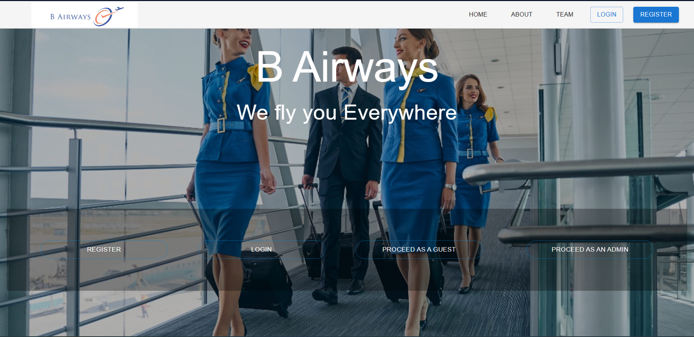

# AirLine_Reservation_System_Project


A simple Airline Reservation System. [Sample Screenshots](./Screenshots)

## Project Description

B Airways is a subsidiary of Virgin Airlines but functions independently. It currently caters only to the needs of small distance, internal flights in Indonesia. Hence, they do not possess access to the advance airline reservation system of Virgin. With the recent gain of popularity, the director board of B Airways has decided to expand the airline to cover multiple destinations worldwide. For this process, B purchased several, refurbished aircrafts to be used in the newer routes. Among those are 3 of Boeing 737, 4 of 757, and single Airbus A380. Each model has a varying seating capacity that is consistent among the model. As the first stage of expansion, B would fly on routes covering CGK and DPS (Indonesia), BIA and HRI (Sri Lanka), DEL, BOM, MAA (India), BKK and DMK (Thailand), SIN (Singapore). Multiple flights will be created covering these destinations. In B systems, a flight has a designated origin and a destination. For an example BIA to BKK is considered as one flight. It is also referred to as a route, yet currently B does not offer transit/ transfer flights. Hence only two locations are related to a given flight, B would pre-define a flight schedule for each flight every day. Each scheduled flight would have the corresponding flight details and an assigned airplane. Two airplanes cannot be assigned to the same flight schedule at the same time. Flight schedule is static in general. Only exception being the flight delays, in which the schedule is updated to reflect the delay. When a passenger need to book a flight, he or she should first login to their online platform. Passenger could either continue as a guest of register with the platform. Registered users are categorized as Frequent and Gold depending on the number of times they have booked with B. They would get 5% and 9% discounts off the final ticket prices respectively. The platform will first show the user with the flight schedule for each day, where the user could select a flight. Once selected, user is prompted with a seat selection. No two users can select the same seat and B does not overbook the seats as other airlines. Once a seat is selected, a booking is created. The booking is considered completed after payments. Payments will not be handled by the system.A ticket is allocated when the booking is completed. The prices may vary depending on the traveler class (Economy, Business or Platinum).

The management of B has hired your team to provide expert consultation on database design for their new airline reservation system. It encapsulate all the above features. Additionally they need to create space for the database to expand in future when new airports are added to the supported destinations. Airports must have an airport code which is universally agreed. Also the city of airport location must be stored. Locations must be defined in a hierarchical manner.
Ex: Sri Lanka → Colombo → BIA, USA → New York State → New York City → JFK.
Depending on the location, the levels of hierarchy may vary.Further, the management require the system to produce the following reports,
- Given a flight no, all passengers travelling in it (next immediate flight) below age 18,
above age 18
- Given a date range, number of passengers travelling to a given destination
- Given a date range, number of bookings by each passenger type
- Given origin and destination, all past flights, states, passenger counts data
- Total revenue generated by each Aircraft type

#### Task
Your task is to model the database design to encapsulate these requirement. It should consider all entities and relationships given in the description. Moreover you need to identify the places where procedures, functions and triggers can be employed to guarantee ACID properties. Foreign keys and primary keys must be set to maintain consistency. Indexing should be done when necessary. Additionally, the you must get a domain idea by reading related material and take assumptions when not explicitly provided. The database must be populated with all the destination given above (at least) and with at least 30 flights. (select any two airports and create a flight). Knowledge about flight codes and related information must be studied to determine the necessary fields of the table. Flight schedule for at least 7 days must be already added in the database. Above data can be inserted manually using SQL queries or an interface. There is no need to create UI elements to simply input data.

## Setup Guide

### Node.js setup

First, clone the project repository.

```bash
git clone https://github.com/Chanuka-ChandraYapa/AirLine_Reservation_System_Project.git
```

Install node and npm to the local computer using the following guidelines.

* [node.js](https://nodejs.org/en/)
* [npm](https://www.npmjs.com/get-npm)


 Next, go to the project root folder using cmd or a code editor and run `npm install` command to install basic dependencies. Then run the same command in the client directory and server directory as follows.

```bash
npm install
cd client
npm install
cd ..
cd server
npm install
```
Now, all the dependencies are installed. Then use `npm start` in the client directory to access the frontend and use  `node index.js` to activate backend api.

```bash
cd client
npm start
cd ..
cd server
node index.js
```

The site should be running on <http://localhost:3000/>
